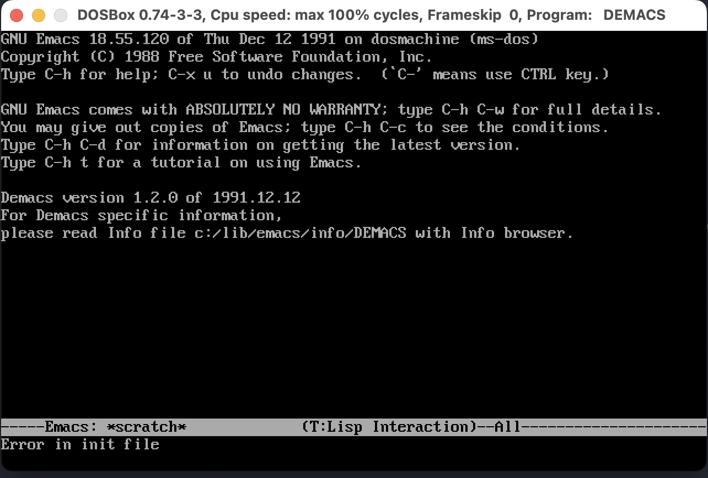

# Emacs 18.55 for MS DOS (demacs)

This repository contains configured MS DOS Emacs 18.55 from 1991. I've fixed the directory structure and set Environment variables. It's ready to run.

### How to run

You can use [DosBOX](https://www.dosbox.com) or any other DOS emulator. Or perhaps real DOS on real old machine 🫡
Below are the steps which work on DosBox.

1. Clone the repo and mount the directory in DosBox as drive `C:`
`mount c demacs`

2. Go to drive `C:` and run `start.bat`
The file contains all environment variables needed for Emacs to run properly. You can teak them at your liking. Just make sure you read the original README by the authors of the port. It's in the repo.

